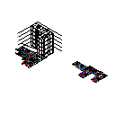
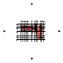

# CDCRD-Digital

### Normativa trazable · Automatización BIM · Evidencia de ingeniería

**Consulta el Código de Construcción de la República Dominicana con referencia a su página
de origen y conecta sus datos con flujos de trabajo en Revit, ETABS y SAFE.**

El proyecto reúne **5 volúmenes, 34 títulos y 6,580 cláusulas**, tablas listas para cálculo,
herramientas MCP y revisiones documentadas. Su propósito es hacer que cada decisión pueda
rastrearse desde la fuente normativa hasta los datos y la evidencia del modelo.

[Explorar la norma](datos/INDICE.md) · [Instalar](instalacion/INSTALACION.md) ·
[Herramientas](#los-servidores-mcp) · [Casos e informes](#casos-e-informes) ·
[Documentación técnica](#documentacion-tecnica)

| Capa | Qué aporta | Punto de entrada |
|---|---|---|
| **Normativa** | Cláusulas, tablas y referencias al PDF oficial | [Índice del código](datos/INDICE.md) |
| **BIM y cálculo** | Lectura, modelado y documentación mediante herramientas especializadas | [Arquitectura del ecosistema](docs/ARQUITECTURA-ECOSISTEMA.md) |
| **Verificación** | Evidencia, hallazgos y límites de cada caso | [Informe BIM multidisciplinar](docs/casos/residencial-bim/INFORME.md) |

La cobertura del texto normativo y la disponibilidad de herramientas son distintas de la
verificación de un proyecto. Cada informe identifica qué se comprobó y qué evidencia falta.

> Fuente oficial: MIVHED — Ministerio de la Vivienda, Habitat y Edificaciones. Este proyecto
> reproduce el texto normativo citando la fuente, conforme al articulo 41 de la Ley 65-00 de
> Derecho de Autor. No es un documento oficial: ante cualquier diferencia, manda el PDF del
> MIVHED.

## Que hay aqui (sin necesidad de programar)

| Si usted busca... | Abra... |
|---|---|
| Por donde empezar cualquier busqueda | [datos/INDICE.md](datos/INDICE.md) — mapa de los 5 volumenes, **6,580 clausulas** |
| Que dice la clausula X del Volumen I (estructural) | `datos/titulos/` — un archivo por Titulo (T02 = Cargas, T05 = Hormigon...) |
| Hidrosanitaria, electrica, mecanica o arquitectura (Vols II-V) | `datos/vol-2/` a `datos/vol-5/` (JSON) o `md/` (legible aqui mismo en GitHub) |
| La carga viva de un uso (oficina, aula, parqueo...) | `datos/machine/cargas_vivas.json` — los 45 usos de la Tabla 4 |
| Los factores R, Cd y limites de altura de su sistema | `datos/machine/sistemas_estructurales.json` — la Tabla 11 completa (44 sistemas) |
| Como armar el espectro de diseño de su proyecto | `datos/machine/espectro_diseno.json` + `factores_sitio.json` |
| Las combinaciones de carga LRFD y ASD | `datos/machine/combinaciones.json` |
| Conectar la IA con ETABS, SAFE o Revit | [ETABS](servidor-mcp/), [SAFE](servidor-mcp-safe/), [Revit](revit-mcp-tools/) + [instalacion](instalacion/INSTALACION.md) |
| Que la IA modele un edificio en Revit desde cero y saque planos | `revit-mcp-tools/ejemplos/residencial-4n/` — receta de 30 pasos, corrida verificada |
| Un edificio completo modelado y verificado por IA, paso a paso | `revision/` — 10 bloques con capturas de pantalla de ETABS |
| Como se verifico la digitalizacion | `verificacion-vols/` |
| Generar DXF, convertir previews, revisar IFC/IDS y consultar CDCRD localmente | [herramientas-locales/](herramientas-locales/README.md) — CLI, entorno reproducible y MCP de 10 herramientas |

Los `.json` se abren con cualquier editor de texto (Bloc de notas incluido) o se arrastran a
una conversacion con una IA. Cada valor trae su clausula, tomo y pagina de origen: **la cita
para su memoria de calculo viaja con el numero**.

## Cobertura de la capa normativa

| Vol | Contenido | Clausulas | Titulos |
|---|---|---|---|
| I | Estructural (cargas, suelos, hormigon, acero, madera, mamposteria...) | 3,492 | 11 |
| II | Instalaciones Hidrosanitarias | 465 | 8 |
| III | Instalaciones Electricas | 497 | 1 |
| IV | Instalaciones Mecanicas | 976 | 8 |
| V | Diseño Arquitectonico | 1,150 | 6 |
| | **Total** | **6,580** | **34** |

El Titulo 6 del Vol I (MHADL) figura "en desarrollo" en el propio codigo: no tiene clausulas.

**Como se verifico** (`verificacion-vols/`): el parser es determinista, sin IA en el camino
critico. El Vol I se volvio a procesar con el codigo nuevo y salio **bit a bit identico** al
que ya estaba en el repo, lo que descarta regresiones. El texto huerfano previo a la primera
clausula es de 28 a 106 caracteres por volumen (portadillas): todo lo demas queda asignado.
El muestreo se hizo contra la pagina renderizada a 110 dpi, no contra la extraccion.

Un hallazgo del metodo, por si sirve a quien digitalice normas: **la numeracion impresa no es
jerarquia confiable** — hay ids duplicados en el documento oficial —, asi que el Titulo se
asigna por posicion en el documento, no por el prefijo del id.

## Para que sirve en la practica

1. **Consultar el codigo con IA sin subir 1,800 paginas.** Suba solo el archivo del tema que
   necesita: la respuesta llega con clausula y pagina citadas, gastando ~70 veces menos.
2. **Modelar y diseñar con ayuda de la IA.** Los servidores MCP cubren el ciclo: geometria,
   materiales, secciones, apoyos, diafragmas, cargas, espectro, combinaciones, correr el
   analisis y leer derivas, reacciones y resultados de diseño. Los parametros del codigo
   (cargas por uso, espectro, R, Cd) salen de estos mismos archivos.
3. **Auditar sus plantillas de Excel contra el codigo nuevo.** Primer resultado real en
   `validacion/`: una plantilla profesional en uso tenia la carga de escaleras **18% por
   debajo** del CDCRD (3.92 vs 4.79 kN/m²). Ese tipo de hallazgo es el objetivo del proyecto.
4. **Levantar un modelo BIM completo en Revit desde una descripcion.** `revit-mcp-tools`
   cubre niveles y ejes, tipos, columnas, vigas, losas, muros, zapatas,
   plantas, tablas, laminas, PDF, IFC y la exportacion a `proyecto.json` para ETABS. Cada
   herramienta de escritura simula primero (`dry_run`), marca lo que crea para poder
   deshacerlo, y la salida grafica se exporta a PNG para que la IA la **mire** antes de
   entregarla. El ejemplo `ejemplos/residencial-4n` (edificio de 4 niveles y 8
   apartamentos, nombres inventados) corre de punta a punta en ~15 s.

## Los servidores MCP

| Servidor | Que opera | Estado |
|---|---|---|
| `herramientas-locales/` | Archivos DXF/IFC/IDS/PDF y corpus CDCRD, sin aplicaciones BIM vivas | CLI y **10 herramientas MCP stdio**, entorno Python aislado; [instalacion y ejemplos](herramientas-locales/README.md) |
| `servidor-mcp/` | ETABS (OAPI 2.016) | **54 herramientas**, probado de punta a punta contra ETABS 23.3.0 |
| `servidor-mcp-safe/` | SAFE — losas, zapatas, franjas, punzonamiento, presion de suelo | v0.1.0, probado en vivo contra un modelo real de fundacion |
| [revit-mcp-tools/](revit-mcp-tools/README.md) | Revit 2027 via pyRevit Routes — modelar, documentar, armado y exportacion a ETABS | Modelado y documentacion probados en la receta `residencial-4n`; alcance y validacion por herramienta en su README |
| `revit-mcp-write/` | Revit 2027 via pyRevit Routes — lectura e inventario, y escritura (pushbuttons) | 9 herramientas; las tres que **mutan** el modelo aun sin corridas reales |
| `puente-autocad-etabs/` | Extraccion de geometria desde DWG por convencion de capas | Inventario y convencion definidos (`docs/CONVENCION-CAPAS-CAD.md`) |

Como encajan entre si: [arquitectura del ecosistema](docs/ARQUITECTURA-ECOSISTEMA.md).
Capacidades pendientes y su estado: [huecos ETABS/SAFE](docs/HUECOS-ETABS-SAFE.md).

## Casos e informes

### Caso residencial BIM — revisión multidisciplinar

[**Leer el informe y la matriz de verificación →**](docs/casos/residencial-bim/INFORME.md)

[Descargar la síntesis pública en PDF](docs/casos/residencial-bim/INFORME.pdf)

La revisión reúne arquitectura, estructura e instalaciones para detectar inconsistencias,
comprobar la correspondencia entre planos y modelo, y dejar explícitos los datos que faltan.
La edición pública utiliza una identificación anónima del caso. Los hallazgos CAD y las
correcciones comunicadas deben distinguirse de las comprobaciones independientes del modelo.

| Arquitectura · archivo RVT | Estructura · archivo RVT |
|:---:|:---:|
|  |  |

Miniaturas embebidas de los archivos RVT guardados, extraídas sin modificar sus píxeles
(128 × 128). Identifican visualmente los archivos; no son capturas de la sesión actual ni
prueba de cumplimiento. Las vistas de alta resolución siguen pendientes.

| Evidencia del caso | Estado de publicación |
|---|---|
| Informe de coordinación ARQ / EST / MEP | [Informe con alcance, hallazgos y pendientes](docs/casos/residencial-bim/INFORME.md) |
| Revit — arquitectura | Captura del modelo actual pendiente de exportación y revisión |
| Revit — estructura | Captura del modelo actual pendiente de exportación y revisión |
| ETABS — análisis del caso residencial | Evidencia pendiente; la demostración inferior corresponde a otro modelo |
| SAFE — cimentación del caso residencial | Evidencia pendiente |

Las nuevas herramientas de auditoría MEP se documentan en [Revit MCP Tools](revit-mcp-tools/README.md).
El inventario y la conectividad ayudan a localizar omisiones; no sustituyen el cálculo de
caudales, cargas, ventilación, protección contra incendios ni una revisión normativa completa.

### Demostración ETABS — oficinas de tres niveles

**Caso independiente del residencial BIM.** El protocolo existente permite seguir la
geometría, las cargas, el análisis y la lectura de resultados de una demostración controlada.

| Recorrido visual y técnico | Evidencia existente |
|---|---|
| Geometría y secciones | [R02 · Geometría](revision/R02-geometria-niveles/README.md) / [R03 · Materiales y secciones](revision/R03-materiales-secciones/README.md) |
| Espectro y análisis | [R06 · Espectro](revision/R06-sismo-espectro/README.md) / [R08 · Análisis](revision/R08-analisis/README.md) |
| Derivas y equilibrio | [R09 · Derivas](revision/R09-derivas/README.md) / [R10 · Reacciones](revision/R10-reacciones/README.md) |

Las capturas históricas se consultan dentro de su protocolo. La galería de portada se
completará con exportaciones limpias, identificadas por caso y disciplina; véase el
[criterio de presentación y evidencia](docs/PRESENTACION.md).

## El servidor de ETABS, probado de punta a punta

`revision/` documenta un protocolo de 10 bloques ejecutado contra un edificio de oficinas de
3 niveles, 2x2 crujias de 6x6 m. Cada bloque tiene su criterio de aceptacion escrito **antes**
de ejecutarlo, la respuesta de la API, y capturas de la pantalla de ETABS que permiten cotejar
el numero de la API contra el que muestra el programa.

| Bloque | Que verifica | Resultado |
|---|---|---|
| R01 | Conexion OAPI y unidades | OK |
| R02 | Geometria: 36 puntos, 63 frames, 12 areas | OK — niveles: paso manual, ver abajo |
| R03 | Materiales y secciones | OK — E = 2.487e7 kN/m² |
| R04 | Apoyos empotrados y diafragmas rigidos | OK — 9 apoyos, 3 diafragmas |
| R05 | Patrones de carga y asignacion a losas | OK — 12/8/4 areas segun cota |
| R06 | Espectro CDCRD y casos Ex/Ey | PARCIAL — ver limitaciones |
| R07 | Combinaciones LRFD con Ev | OK — 7 combos, factores 1.2975 / 0.8025 |
| R08 | Ejecucion del analisis | OK — T₁ = 0.358 s, masa participante 1.0 |
| R09 | Derivas contra el limite del CDCRD | OK — cumple con ρ=1.0 y con ρ=1.3 |
| R10 | Reacciones y equilibrio | OK — ΣFz cierra al 0.65% |

**33 de 34 capturas** tomadas (`revision/RESUMEN-CAPTURAS-2026-08-08.md`).

Despues del protocolo se corrio un caso de mayor escala (**TORRE A**, 51 niveles, 224 m,
4,529 objetos cargados por API en un modelo en blanco): la clasificacion automatica de ETABS
cuadro grupo por grupo con el dataset y los nudos coincidieron exactos a 1 mm. El equilibrio
cerro al **−0.24%**. Ese ejercicio destapo dos desconexiones de geometria que el dataset de
origen escondia y que se manifestaron como autovalores negativos: util como recordatorio de
que **el analisis es tambien un control de calidad del modelo**, no solo un resultado.

### Limitaciones conocidas

Se listan porque quien vaya a usarlo las va a encontrar, y porque un README que solo cuenta lo
que funciona no sirve para decidir si adoptarlo.

- **No redefine los niveles de un modelo que ya tiene objetos.** No es un defecto del servidor:
  la OAPI lo rechaza. **Definir los niveles antes de crear la geometria**, o hacerlo a mano en
  `Edit > Stories and Grid System Data`.
- **`define_cdcrd_spectrum` fallaba con `ret=-99`** en instalaciones donde `FuncRS.SetUser` no
  responde; el rodeo es escribir la funcion por la tabla `Functions - Response Spectrum - User
  Defined`. En el caso de 51 niveles la herramienta **si funciono** y `get_spectrum` releyo los
  12 puntos, que verifican contra el calculo manual.
- **Ningun `add_*` es idempotente.** Reejecutar un bloque sobre el mismo modelo falla si el
  nombre existe, y `SetCaseList` **agrega** factores en vez de reemplazarlos.
- **Tablas de diseño por API**: los lectores de columnas y juntas funcionan; el de vigas
  requirio corregir la firma (23 arrays, no 22).

### La regla de metodo que salio de estas corridas

El mensaje de retorno de una herramienta dice **lo que ella creo**, no **lo que hay en el
modelo**. ETABS aporta objetos por defecto que colisionan con el protocolo: aparecio con el
diafragma `D1`, con los patrones `Dead`/`Live` —y `Dead` traia peso propio = 1, que habria
duplicado la masa sismica sin ningun error visible— y con la losa `Slab1`. **Leer la tabla y
contar**, siempre. Por eso los servidores incluyen lectores dedicados (`get_load_patterns`,
`get_materials`, `get_area_sections`, `get_diaphragms`...) y no solo escritores.

La misma regla, en el puente Revit → ETABS: **un export a CSV es una proyeccion con perdida**.
Cruzando el CSV contra la API del modelo abierto aparecieron un tipo cuyo nombre mentia sobre
su geometria, y vigas que el export omitia por completo. Si el modelo origen esta abierto,
verificar contra su API antes de modelar.

## Estado y pendientes

- Capa normativa: **6,580 clausulas** en los 5 volumenes, con espejo legible en `md/`.
- Tablas listas para calculo: **8 archivos** que cubren el flujo sismico completo del Titulo 2
  (cargas → sitio → espectro → categoria de diseño → sistema → combinaciones → derivas).
- Pendiente: tablas de viento; pase de vision sobre tablas y formulas de los Vols II-V;
  formulas en notacion matematica limpia.

Advertencia honesta: las clausulas marcadas `"formula": true` y `"vision_ok": false` pueden
tener simbolos corruptos heredados del PDF — **no las cite sin verificar contra el original**.

## Politica de datos

Este es un repositorio **publico** y su contenido es la norma (publica) y las herramientas.
Los ejemplos utilizan nombres inventados. Los casos autorizados para divulgación se presentan
mediante informes e imágenes seleccionados y anonimizados, sin nombres de clientes,
proyectos o profesionales ni rutas personales. Los modelos, planos completos, memorias y
salidas de trabajo permanecen en sus proyectos. Las salidas de corrida de los scripts
(`_log/`), que contienen ids y geometria del modelo abierto al momento de la prueba, estan
excluidas por `.gitignore`. Véase el [criterio de publicación](docs/PRESENTACION.md).

## Documentacion tecnica

Como se construyo, como continuarlo y el contrato de datos: `docs/TECNICO.md` y
`docs/ESQUEMA.md`. Esquema de `proyecto.json`: `docs/ESQUEMA-PROYECTO.md`. Instalacion de los
servidores: `instalacion/INSTALACION.md`. Gotchas verificados del API (semantica real de
`set_table_data`, filtros por elevacion, timeouts de `run_analysis`) con causa raiz y regla:
`servidor-mcp/ERRORES.md`.
