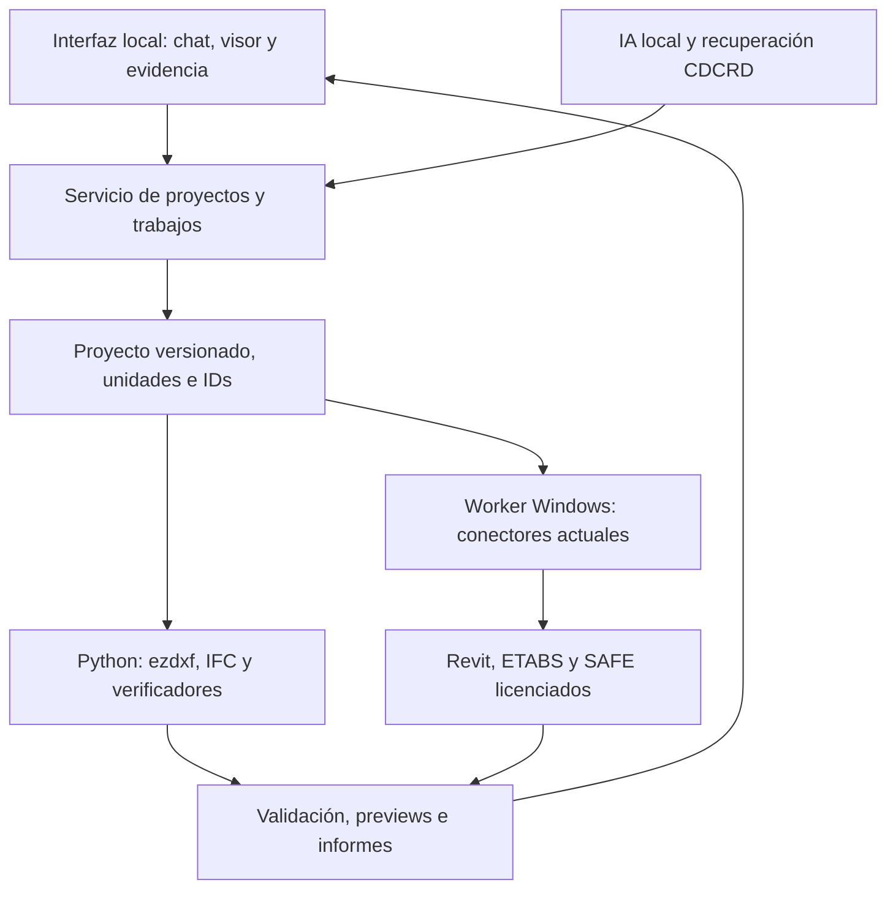

# Herramientas para una plataforma local de AI + BIM + CDCRD

Investigación para CDCRD-Digital · República Dominicana · 8 de octubre de 2026

**Recomendación principal:** construir un núcleo local de datos, planos y verificaciones con Python, ezdxf e IfcOpenShell, aprovechando los conectores actuales de Revit/ETABS/SAFE. Empezar en Windows; añadir Ubuntu mediante WSL2 cuando los trabajos de OCR, conversión o datos lo justifiquen. Una VM Ubuntu completa queda para un laboratorio posterior.

La prioridad responde a tu preferencia por herramientas gratuitas y locales. Para una laptop Windows con aproximadamente 16 GB de RAM y 8 GB de VRAM, conviene ejecutar los trabajos pesados por turnos y medir antes de añadir servicios permanentes.

**Confianza:** alta en capacidades y restricciones documentadas; media en la arquitectura propuesta; pendiente de prueba en fidelidad de conversiones, rendimiento y aceptación de planos. Esta investigación no realizó instalaciones, conversiones de muestra ni corridas nuevas de Revit/ETABS/SAFE.

## 1. Qué conviene conservar y qué falta conectar

Revisé el repositorio en el commit `5eca3148037813b78d337ee3b9fd6e6574fa05d9`, del 6 de octubre de 2026. El proyecto ya contiene el corpus de cinco volúmenes, tablas normativas estructuradas, herramientas de verificación y adaptadores de aplicaciones. Su README declara 6,580 cláusulas, 54 herramientas ETABS y 36 herramientas Revit. Esas cifras y las corridas históricas son evidencia declarada del repo, no nuevas validaciones hechas durante esta investigación. [README del corte revisado](https://github.com/dashy2004/CDCRD-Digital/blob/5eca3148037813b78d337ee3b9fd6e6574fa05d9/README.md).

| Capacidad | Evidencia actual | Decisión propuesta |
|---|---|---|
| Planos desde Revit | Plantas, etiquetas, cotas, láminas y exportadores; `revit_exportar_hojas` genera DWG/DXF | Conservar y agregar control de calidad y paquetes de entrega |
| Revit → datos estructurales | `exportar_proyecto.py` escribe geometría en metros y argumentos ETABS | Convertir `proyecto.json` en contrato validado y versionado |
| CAD → datos | Convención de capas e inventario; el extractor está planteado documentalmente | Implementar primero un importador DXF con alcance acotado |
| Verificación CDCRD | Scripts para derivas, masa modal, irregularidades, escalado y zapatas | Exponerlos como herramientas de la IA con evidencia y estados incompletos |
| SAFE | El changelog tiene correcciones y herramientas posteriores al README general | Elaborar inventario desde código, con estado implementado/probado por herramienta |

Fuentes del repo: [Revit](https://github.com/dashy2004/CDCRD-Digital/blob/5eca3148037813b78d337ee3b9fd6e6574fa05d9/revit-mcp-tools/README.md), [exportación DXF](https://github.com/dashy2004/CDCRD-Digital/blob/5eca3148037813b78d337ee3b9fd6e6574fa05d9/revit-mcp-tools/src/tools/exportar_hojas.py), [exportación del proyecto](https://github.com/dashy2004/CDCRD-Digital/blob/5eca3148037813b78d337ee3b9fd6e6574fa05d9/revit-mcp-tools/src/tools/exportar_proyecto.py), [capas CAD](https://github.com/dashy2004/CDCRD-Digital/blob/5eca3148037813b78d337ee3b9fd6e6574fa05d9/docs/CONVENCION-CAPAS-CAD.md), [SAFE changelog](https://github.com/dashy2004/CDCRD-Digital/blob/5eca3148037813b78d337ee3b9fd6e6574fa05d9/servidor-mcp-safe/docs/CHANGELOG.md).

Hay una diferencia importante entre documentos del repo: la arquitectura de agosto se identifica como diseño y describe huecos que las herramientas Revit de septiembre ya cubren parcialmente. Recomiendo actualizar ese mapa antes de planificar desarrollo; atribuir a todo el sistema el estado de un documento antiguo produciría trabajo duplicado. [Arquitectura](https://github.com/dashy2004/CDCRD-Digital/blob/5eca3148037813b78d337ee3b9fd6e6574fa05d9/docs/ARQUITECTURA-ECOSISTEMA.md), [Revit actual](https://github.com/dashy2004/CDCRD-Digital/blob/5eca3148037813b78d337ee3b9fd6e6574fa05d9/revit-mcp-tools/README.md).

## 2. El componente dominicano que determina el producto

El MIVHED informa que el CDCRD fue oficializado por la Resolución 007-2026. Su FAQ establece transición hasta el **10 de abril de 2027** y obligatoriedad para nuevas solicitudes VUC desde el **11 de abril de 2027**. Durante la transición permite elegir expresamente el régimen aplicable y prohíbe mezclar ambos regímenes en un expediente; los proyectos depositados anteriormente conservan su régimen. [FAQ oficial MIVHED](https://mivhed.gob.do/codigo-de-construccion-cdcrd-faq/), [comunicado de oficialización](https://mivhed.gob.do/noticias-nuevas/mivhed-emite-resolucion-que-oficializa-el-codigo-de-construccion-de-la-republica-dominicana/).

**Consecuencia para el diseño:** cada proyecto necesita fecha de depósito, régimen elegido, edición documental, fuente y hash del PDF, además de las versiones de las reglas ejecutadas. La app debe poder explicar por qué aplicó cierta regla. La fecha de extracción de un JSON y la fecha de la norma son campos distintos. El esquema actual utiliza la etiqueta `CDCRD 2026-07`; propongo reconciliarla con el documento oficial concreto y su procedencia, sin asumir que esa etiqueta identifica una revisión jurídica. [Esquema del repo](https://github.com/dashy2004/CDCRD-Digital/blob/5eca3148037813b78d337ee3b9fd6e6574fa05d9/docs/ESQUEMA-PROYECTO.md), [resolución íntegra disponible](https://mivhed.gob.do/wp-content/uploads/2026/04/MIVHED-Resolucion_No_007-2026.pdf).

El valor comercial propuesto es una herramienta que reúna modelo, cálculo y cláusula verificable. Para cada observación debería mostrar: elemento afectado, dato medido, unidades, regla aplicada, volumen/título/cláusula/página y estado de revisión. Esta es una propuesta de producto; no una certificación del modelo ni una integración ya construida.

## 3. Ubuntu, WSL2, contenedores y tu laptop

| Alternativa | Para qué sirve aquí | Recomendación |
|---|---|---|
| Python nativo en Windows | DXF, IFC, previews, búsqueda y verificadores locales | Primera etapa: menos servicios y conexión sencilla con aplicaciones existentes |
| Ubuntu en WSL2 | OCR, herramientas Linux, backend y pruebas de despliegue | Segunda etapa o cuando una dependencia lo facilite |
| Docker Engine en Ubuntu/WSL2 | Empaquetar servicios reproducibles | Opcional; una sola base y pocos contenedores |
| Docker Desktop | Administración gráfica de contenedores | Opcional; revisar condiciones de uso de la organización |
| VM Ubuntu completa | Aislamiento de laboratorio, snapshots y ensayo de servidor | Posterior; consume recursos adicionales |
| Servidor Ubuntu independiente | Procesar documentos/conversiones para varios usuarios | Cuando la continuidad y la carga lo requieran |

WSL permite Linux junto a Windows y Ubuntu tiene instrucciones oficiales. WSL2 usa virtualización administrada y no exige instalar una VM completa adicional. El rol de Hyper-V para una VM administrada requiere una edición compatible, como Pro/Enterprise; el Windows Home observado no ofrece ese rol. Es una restricción distinta de WSL2. [Microsoft WSL](https://learn.microsoft.com/en-us/windows/wsl/install), [Ubuntu WSL2](https://ubuntu.com/wsl/docs/latest/howto/install-ubuntu-wsl2/), [requisitos Hyper-V](https://learn.microsoft.com/windows-server/virtualization/hyper-v/host-hardware-requirements?pivots=windows).

Docker Desktop tiene uso gratuito bajo condiciones específicas; la documentación establece límites para pequeñas empresas y suscripción para entidades gubernamentales. Docker Engine dentro de Ubuntu es una ruta alternativa. Para este MVP individual, contenedores y Desktop pueden esperar hasta aportar una ventaja operativa concreta. [Licencia Desktop](https://docs.docker.com/subscription-billing/desktop-license/), [Docker sobre WSL2](https://docs.docker.com/desktop/features/wsl/).

**Presupuesto inicial propuesto para el equipo observado:** comenzar con procesos nativos y una tarea pesada a la vez. Si se introduce WSL2, ensayar un límite de 3–4 GiB y pocos procesos mientras las aplicaciones BIM están abiertas. Es un punto de medición, no garantía de que el conjunto quepa. Una ampliación a 32 GiB, si el equipo la admite, facilitaría la concurrencia; confirmar ranuras, compatibilidad y carga antes de comprar. ETABS publica 16 GB mínimos y 64 GB recomendados, por lo que los 16 GB actuales dejan poco margen para varios trabajos simultáneos. [Requisitos ETABS](https://www.csiamerica.com/products/etabs/system-requirements).

La distribución Ubuntu debe elegirse por compatibilidad de dependencias y soporte. La documentación actual de Canonical ya contempla 26.04 LTS; 24.04 LTS puede evaluarse como base conservadora. Evitar que “última versión” sustituya la prueba de los paquetes BIM necesarios. [Documentación Ubuntu](https://ubuntu.com/wsl/docs/latest/howto/install-ubuntu-wsl2/).

## 4. Generación de planos: incorporación de mayor retorno

### Motor propio con ezdxf

**Prioridad inmediata.** ezdxf permite leer, crear y modificar DXF mediante Python, con licencia MIT y uso multiplataforma. Su add-on de dibujo produce previews mediante varios backends. Complementa el exportador de Revit y permite generar plantas o detalles repetitivos sin abrir Revit. [ezdxf](https://ezdxf.readthedocs.io/en/stable/), [drawing/export](https://ezdxf.readthedocs.io/en/stable/addons/drawing.html).

Propuesta de flujo:

1. La IA recoge requisitos y propone cambios a un JSON de proyecto validado.
2. El motor geométrico construye líneas, polilíneas, bloques y cotas desde medidas explícitas.
3. ezdxf genera modelo 1:1 y layouts con escala, cajetín, revisión y leyendas.
4. Se reabre el DXF, se audita y se compara contra el JSON.
5. Se genera SVG/PDF/PNG para inspección; se abre además en el CAD destinatario.
6. El profesional revisa y libera la lámina.

Comenzaría por plantas de ejes/columnas, plantas esquemáticas de losas, cuadros y detalles repetitivos. El detallado estructural debe recibir dimensiones y armado de resultados revisados; un modelo de lenguaje no debe inventar refuerzo a partir de un dibujo.

Las cotas de ezdxf requieren generar su representación gráfica mediante `.render()`. El renderer tiene limitaciones documentadas: no procesa sólidos ACIS y las vistas 3D se proyectan como vista superior; tampoco reproduce todo MTEXT con fidelidad exacta. Las previews ayudan a revisar, pero hay que probar cotas, tipografías y escala en AutoCAD/LibreCAD/Revit según el destinatario. [Cotas](https://ezdxf.readthedocs.io/en/stable/tutorials/linear_dimension.html), [límites del renderer](https://ezdxf.readthedocs.io/en/stable/addons/drawing.html).

**Criterio de aceptación propuesto:** una distancia conocida debe coincidir en JSON, entidad DXF y cota; modelo y papel deben tener unidades explícitas; ninguna etiqueta debe quedar cortada; las áreas cerradas deben conservarse. Primero probar un proyecto pequeño con tolerancias fijadas por disciplina.

### Herramientas de apoyo y alternativas

| Herramienta | Beneficio | Decisión y limitación |
|---|---|---|
| LibreCAD | Abrir, medir, corregir e imprimir DXF; GPLv2, Windows/Linux/macOS | Útil para revisión humana; importación DWG parcial |
| Inkscape | Cajetines SVG, composición y ajustes gráficos; GPL | Útil para documentación; trazado de raster produce caminos sin significado BIM |
| FreeCAD BIM/TechDraw | Autoría abierta y documentación paramétrica; LGPL2+ | Piloto posterior: su exportación DXF de TechDraw no incluye todo el cajetín SVG ni vistas Draft/Arch directamente |
| Bonsai sobre Blender | Modelado IFC y documentación SVG; GPL-3.0-or-later | Vía abierta para usuarios sin Revit; documentación de dibujo advierte desarrollo temprano |

Fuentes: [LibreCAD](https://www.librecad.org/), [capacidades CAD](https://dokuwiki.librecad.org/doku.php/start), [Inkscape licencia](https://inkscape.org/en/about/license/), [trazado Inkscape](https://inkscape.org/en/doc/tutorials/tracing/tutorial-tracing.html), [FreeCAD BIM](https://github.com/FreeCAD/FreeCAD-documentation/blob/main/wiki/BIM_Workbench.md), [TechDraw DXF](https://github.com/FreeCAD/FreeCAD-documentation/blob/main/wiki/TechDraw_ExportPageDXF.md), [FreeCAD licencia](https://github.com/FreeCAD/FreeCAD-documentation/blob/main/wiki/License.md), [Bonsai dibujos](https://docs.bonsaibim.org/studio/guides/drawings/index.html).

## 5. Un convertidor de archivos con alcance explícito

Propongo una herramienta de conversión que anuncie qué preserva, qué se pierde y qué necesita reconstruirse. Cada salida debe incluir formatos/versiones, unidades, hash de entrada, motor utilizado, advertencias y resultado de validación.

| Entrada → salida | Ruta investigada | Prioridad / alcance |
|---|---|---|
| RVT → IFC/DXF/DWG/PDF | Exportadores existentes de Revit, en Windows | Inmediata; usar la aplicación de origen |
| DWG ↔ DXF | ODA File Converter local | Alta, opcional; comprobar versión, fuentes, entidades y EULA |
| DWG → DXF/JSON | GNU LibreDWG | Piloto abierto con formatos y entidades acotados |
| DXF → SVG/PNG/PDF | ezdxf drawing y backend elegido | Alta para planos 2D admitidos |
| IFC → GLB/OBJ/SVG | IfcConvert | Alta para intercambio y visualización |
| IFC → planos DXF | Proyección/corte y anotación; Bonsai o motor propio | Desarrollo específico; no simple conversión de extensión |
| PDF vectorial → datos/posible DXF | pdfplumber, calibración y reconstrucción | Experimental; se pierde semántica CAD |
| PDF escaneado/foto → datos/posible DXF | OCR y trazado asistido | Posterior; exige medida de referencia y corrección |
| DXF/PDF → IFC | Reconstrucción de elementos, niveles y propiedades | Experimental; distinguir muro de línea requiere interpretación |

ODA ofrece aplicación gratuita con CLI y auditoría para intercambio DWG/DXF. Es software propietario: no se confirmó en esta investigación autorización para empaquetar el binario o servir conversiones a terceros. La integración propuesta detecta una instalación local separada. GNU LibreDWG es GPLv3+ y una alternativa investigable; su manual describe limitaciones y escritura DXF→DWG experimental. [ODA](https://www.opendesign.com/guestfiles/oda_file_converter), [add-on ODA de ezdxf](https://ezdxf.readthedocs.io/en/stable/addons/odafc.html), [GNU LibreDWG](https://www.gnu.org/software/libredwg/manual/html_node/Programs.html), [licencia y proyecto](https://github.com/LibreDWG/libredwg).

Para PDF, **pdfplumber** extrae texto, tablas y primitivas especialmente de PDFs generados digitalmente. **pypdfium2** permite render local; requiere conservar avisos de PDFium y terceros al distribuir. **Poppler/pdftocairo** es útil como renderer CLI en Ubuntu. [pdfplumber](https://github.com/jsvine/pdfplumber), [pypdfium2](https://github.com/pypdfium2-team/pypdfium2), [pdftocairo](https://manpages.ubuntu.com/manpages/noble/man1/pdftocairo.1.html).

Elegir conscientemente el backend PDF: ezdxf es MIT, pero usar su backend PyMuPDF introduce una dependencia con licencia AGPL/comercial. Para un producto propio puede evaluarse SVG o Matplotlib y un renderer independiente, tras revisar el conjunto de dependencias. [Backends ezdxf](https://ezdxf.readthedocs.io/en/stable/addons/drawing.html), [licencia PyMuPDF](https://pymupdf.io/licensing).

**Distinción de calidad:** un PDF convertido puede verse bien y contener medidas equivocadas. Un DXF recuperado puede tener líneas correctas y carecer de muros, puertas, niveles o materiales identificables. La app debe informar esas diferencias y conservar el origen.

## 6. Núcleo openBIM e interfaz de revisión

| Componente | Incorporación propuesta | Límite |
|---|---|---|
| IfcOpenShell | Consultar elementos IFC, propiedades, unidades y cantidades | IFC físico necesita traducción adicional al modelo analítico |
| IfcConvert | Generar GLB/OBJ/SVG para previews e intercambio | No es convertidor universal RVT/DWG |
| IfcDiff / IfcPatch / IfcCSV | Comparar revisiones, aplicar reparaciones controladas y extraer tablas | Registrar cambios y conservar IDs de origen |
| IfcTester + IDS | Comprobar información requerida antes de cálculos o entregas | Información válida no demuestra capacidad resistente |
| IfcClash + BCF | Detectar interferencias y comunicar hallazgos por elemento | Revisar tolerancias y encuentros intencionales |
| That Open Components + web-ifc | Visor local en navegador con selección y propiedades | Probar memoria con modelos reales y coordenadas grandes |

IfcOpenShell y las utilidades relevantes declaran LGPL-3.0-or-later; Bonsai usa GPL-3.0-or-later. IfcConvert documenta formatos geométricos y remite DXF a Bonsai. IfcTester valida modelos mediante IDS y genera reportes; IfcClash permite grupos/filtros de interferencias. [Herramientas/licencias](https://github.com/IfcOpenShell/IfcOpenShell), [IfcConvert](https://docs.ifcopenshell.org/ifcconvert.html), [IfcTester](https://docs.ifcopenshell.org/ifctester.html), [IfcClash](https://docs.ifcopenshell.org/ifcclash.html).

IDS permite definir requisitos de información interoperables; BCF comunica incidencias y vistas asociadas. La propuesta para CDCRD es exigir identificador, nivel, material, resistencia especificada y procedencia de propiedades antes de ejecutar reglas. Las verificaciones de derivas, capacidad, punzonamiento o geometría compleja necesitan motores adicionales. [buildingSMART IDS](https://www.buildingsmart.org/standards/bsi-standards/information-delivery-specification-ids/), [BCF](https://github.com/buildingSMART/BCF-XML).

That Open Components declara MIT y web-ifc MPL-2.0. Es una opción para seleccionar una columna y abrir sus propiedades, cálculos y observaciones CDCRD. Sus capacidades de modelado están documentadas como trabajo en curso; propongo utilizarlo inicialmente como visor. [Components](https://github.com/ThatOpen/engine_components), [web-ifc](https://github.com/ThatOpen/engine_web-ifc), [documentación](https://docs.thatopen.com/intro).

**IfcMCP merece un experimento posterior:** documenta herramientas de consulta/edición IFC, dibujos y validación. El paquete PyPI consultado por la investigación devolvió 404 el 8 de octubre de 2026, aunque existe documentación. Evaluar el código con un commit fijo y comenzar por lectura; no prometer una instalación estable a partir del nombre. [IfcMCP](https://docs.ifcopenshell.org/ifcmcp.html).

## 7. IA local, corpus y reglas ejecutables

### Búsqueda antes de incorporar muchos servicios

En esta laptop, empezaría con **SQLite FTS5** para consulta textual por cláusula y términos, acompañada de filtros de volumen/título/edición. FTS5 proporciona búsqueda de texto completo y ranking BM25. Verificar que el runtime elegido incluya FTS5 y tratar el identificador de cláusula como campo exacto: la puntuación de `2.10.11` no debe depender sólo del tokenizador. SQLite declara su código de dominio público. [FTS5](https://www.sqlite.org/fts5.html), [situación de licencia](https://www.sqlite.org/copyright.html).

Para multiusuario o consolidación de datos, **PostgreSQL + pgvector** permite guardar proyectos, resultados y búsqueda vectorial en el mismo sistema; combinar recuperación textual y semántica es una propuesta para preguntas en español. Comenzar con búsqueda exacta y medir antes de índices aproximados; no instalar además otra base vectorial sin una necesidad demostrada. [PostgreSQL búsqueda](https://www.postgresql.org/docs/current/textsearch.html), [pgvector](https://github.com/pgvector/pgvector), [licencia pgvector](https://raw.githubusercontent.com/pgvector/pgvector/master/LICENSE).

### Procesamiento documental

**OCRmyPDF + Tesseract** sirve para escaneos consultables; cargar español e inglés cuando corresponda. **Docling** puede extraer estructura y tablas, operar localmente y precargar modelos offline. El código Docling es MIT; los modelos tienen sus propias licencias. Aplicar OCR sólo cuando haga falta y conservar el parser determinista del repo para los documentos donde ya funciona. [OCRmyPDF](https://ocrmypdf.readthedocs.io/en/stable/cookbook.html), [Docling](https://github.com/docling-project/docling), [operación offline](https://docling-project.github.io/docling/usage/advanced_options/).

OCRmyPDF declara MPL-2.0 y Tesseract Apache-2.0; revisar también dependencias incluidas en el despliegue. [Licencia OCRmyPDF](https://raw.githubusercontent.com/ocrmypdf/OCRmyPDF/main/LICENSE), [licencia Tesseract](https://raw.githubusercontent.com/tesseract-ocr/tesseract/main/LICENSE).

El repo ya registra símbolos OCR corruptos y ambigüedades en una auditoría de citas. Recomiendo convertir esos hallazgos en un registro de reglas pendientes de confirmación, enlazado al recorte de página oficial. Los valores extraídos no deben convertirse directamente en una regla aprobada. [Auditoría de citas](https://github.com/dashy2004/CDCRD-Digital/blob/5eca3148037813b78d337ee3b9fd6e6574fa05d9/docs/AUDITORIA-CITAS-VERIFICACIONES-2026-09-27.md).

### Motor normativo y contrato de proyecto

Incorporaciones de alta prioridad:

- **Pydantic**, MIT: entradas y salidas tipadas, límites y validación estricta en fronteras de herramientas.
- **Pint**, licencia BSD: conversiones dimensionales explícitas; distinguir fuerza, masa, presión, rigidez y longitud.
- **Shapely**, BSD-3-Clause: validación y operaciones geométricas 2D; una reparación geométrica debe quedar registrada y revisarse.
- **uv**, Apache-2.0/MIT: entornos y dependencias bloqueadas para repetir el despliegue en Windows/Linux.

Fuentes: [Pydantic strict mode](https://docs.pydantic.dev/latest/concepts/strict_mode/), [licencia Pydantic](https://github.com/pydantic/pydantic/blob/main/LICENSE), [Pint](https://pint.readthedocs.io/en/stable/getting/tutorial.html), [licencia Pint](https://raw.githubusercontent.com/hgrecco/pint/master/LICENSE), [Shapely](https://shapely.readthedocs.io/en/stable/manual.html), [licencia Shapely](https://github.com/shapely/shapely/blob/main/LICENSE.txt), [uv](https://docs.astral.sh/uv/concepts/projects/layout/), [repositorio/licencias uv](https://github.com/astral-sh/uv).

Dos puertas de validación específicas del repo merecen prioridad. El exportador Revit marca algunas secciones o contornos como `bbox` cuando usa cajas envolventes: esos datos deben tratarse como aproximaciones y revisarse antes de calcular. El esquema documental ilustra `k = factor_k * sigma_adm`; como presión y módulo de reacción tienen dimensiones distintas, hay que declarar la dimensión y procedencia del factor, en vez de adoptar esa expresión como conversión genérica. Son controles propuestos sobre esos contratos, no conclusiones sobre un proyecto real. [Exportador](https://github.com/dashy2004/CDCRD-Digital/blob/5eca3148037813b78d337ee3b9fd6e6574fa05d9/revit-mcp-tools/src/tools/exportar_proyecto.py), [esquema](https://github.com/dashy2004/CDCRD-Digital/blob/5eca3148037813b78d337ee3b9fd6e6574fa05d9/docs/ESQUEMA-PROYECTO.md), [Pint y dimensiones](https://pint.readthedocs.io/en/stable/getting/tutorial.html).

Cada comprobación debería devolver `cumple`, `no_cumple`, `no_evaluable` o `requiere_revision`, con entradas, unidades y alcance. Mantener diferencias entre acero requerido, mínimo y provisto, entre modelo físico y analítico, y entre número calculado y texto interpretado. Esta separación ya aparece parcialmente en las verificaciones del repo y debe convertirse en una interfaz uniforme. [Verificador de zapata](https://github.com/dashy2004/CDCRD-Digital/blob/5eca3148037813b78d337ee3b9fd6e6574fa05d9/herramientas/verificacion_zapata.py), [auditoría de alcance](https://github.com/dashy2004/CDCRD-Digital/blob/5eca3148037813b78d337ee3b9fd6e6574fa05d9/docs/AUDITORIA-CITAS-VERIFICACIONES-2026-09-27.md).

### Modelo de lenguaje local

**Ollama**, MIT, funciona nativamente en Windows con GPU compatible y API local. Permite salidas estructuradas y llamadas a herramientas según el modelo elegido. Con 8 GB VRAM, propongo probar primero un modelo pequeño cuantizado, por ejemplo de 4–8B, contexto acotado y una solicitud a la vez; el ajuste real depende de pesos, caché, memoria libre y capacidades del modelo. La licencia del runtime no sustituye la del modelo. [Windows](https://docs.ollama.com/windows), [hardware](https://docs.ollama.com/gpu), [outputs estructurados](https://docs.ollama.com/capabilities/structured-outputs), [tool calling](https://docs.ollama.com/capabilities/tool-calling), [licencia](https://github.com/ollama/ollama/blob/main/LICENSE).

La IA debe interpretar solicitudes, recuperar evidencia, proponer operaciones y explicar resultados. Geometría, unidades y verificaciones deben resolverse con funciones reproducibles. Antes de elegir modelo, crear un conjunto de preguntas dominicanas y evaluar exactitud de citas, manejo de datos faltantes y parámetros de las llamadas. No se hizo un benchmark de modelos en este equipo.

## 8. Arquitectura que aprovecha Windows y puede crecer

Diagrama de la arquitectura propuesta:

Las herramientas abiertas pueden ejecutarse en Windows y luego trasladarse a Ubuntu/WSL cuando convenga. Los adaptadores actuales con COM y Revit permanecen en Windows. CSI publica API oficial para ETABS/SAFE; Revit utiliza API en su propio proceso y las solicitudes externas necesitan el contexto adecuado, como External Events. Reutilizar el puente pyRevit ya existente. [CSI Developer](https://www.csiamerica.com/developer), [API Revit](https://help.autodesk.com/cloudhelp/2024/ENU/Revit-API/files/Revit_API_Developers_Guide/Introduction/Getting_Started/Using_the_Autodesk_Revit_API/Revit_API_Revit_API_Developers_Guide_Introduction_Getting_Started_Using_the_Autodesk_Revit_API_Deployment_Options_html.html), [External Events](https://help.autodesk.com/cloudhelp/2026/ENU/Revit-API/files/Revit_API_Developers_Guide/Advanced_Topics/Revit_API_Revit_API_Developers_Guide_Advanced_Topics_External_Events_html.html).

Contrato propuesto: ID del proyecto y trabajo, hash/revisión de entrada, versión de regla, comando permitido, parámetros tipados y resultado con evidencia. Serializar trabajos por documento/instancia; un reintento debe detectar lo ya creado. Conservar la versión previa de modelos y exportaciones. En WSL, verificar red y firewall: `localhost` depende del modo NAT/mirrored y un contenedor tiene su propio contexto de red. [WSL networking](https://learn.microsoft.com/windows/wsl/networking).

Para un usuario basta una cola persistente sencilla. **Prefect** se puede evaluar para lotes de OCR/conversión; **Temporal** para trabajos duraderos entre máquinas. Añadir cualquiera sólo cuando los reinicios, reintentos o seguimiento lo justifiquen. [Prefect local](https://docs.prefect.io/v3/how-to-guides/self-hosted/server-cli), [Temporal](https://docs.temporal.io/temporal).

### Herramientas nuevas que podría ofrecer el agente

Los nombres siguientes son propuestas, no herramientas disponibles hoy:

| Herramienta propuesta | Entrada / salida y beneficio |
|---|---|
| `cdcrd_buscar` | Pregunta + régimen → cláusulas, páginas y documentos |
| `cdcrd_verificar` | Tipo de comprobación + datos → resultado con alcance/evidencia |
| `proyecto_validar` | JSON/IFC → unidades, IDs, datos ausentes y aproximaciones |
| `cad_importar_dxf` | DXF + mapa de capas → proyecto JSON y dudas de interpretación |
| `cad_generar_plano` | Proyecto + plantilla → DXF y manifiesto |
| `cad_previsualizar` | DXF/hoja → SVG/PNG/PDF con configuración de escala |
| `archivo_convertir` | Entrada + destino soportado → salida, pérdidas y advertencias |
| `ifc_consultar` | Modelo + filtro → propiedades/cantidades por GlobalId |
| `ifc_validar_ids` | IFC + IDS → informe de información requerida |
| `ifc_interferencias` | Modelos + filtros/tolerancias → hallazgos BCF |
| `proyecto_comparar` | Dos revisiones → geometría/propiedades/cálculos afectados |
| `entrega_preparar` | Revisión aprobada → paquete de planos, modelo y evidencia |

La interfaz de usuario propuesta tiene cuatro entradas: consultar CDCRD, revisar modelo, preparar plano y convertir archivo. Las operaciones deben desembocar en un visor y evidencia revisable, con acceso a las aplicaciones existentes cuando corresponde.

## 9. Qué dejar para después

**Speckle** aporta modelos versionados, APIs y colaboración. Su núcleo puede alojarse localmente, pero requiere operar servicios y no incluye todas las funciones de la oferta gestionada. El conector ETABS oficial es de publicación, Windows y versiones 21/22/23; no proporciona importación de retorno. Esperaría hasta tener varios usuarios o una necesidad clara de coordinación. [Self-host vs cloud](https://docs.speckle.systems/developers/server/self-hosted-vs-cloud-hosted-speckle), [ETABS](https://docs.speckle.systems/connectors/etabs).

**Autodesk APS Automation** sirve para ejecutar trabajos Revit en la nube con restricciones propias y coste por servicio; es una opción futura cuando el volumen lo justifique. **Rhino.Inside.Revit** puede aportar geometría paramétrica si ya se dispone de Rhino; requiere esas aplicaciones comerciales. [APS](https://aps.autodesk.com/automation-apis), [restricciones](https://aps.autodesk.com/en/docs/design-automation/v3/developers_guide/restrictions), [Rhino.Inside deployment](https://www.rhino3d.com/inside/revit/1.0/reference/deployment).

También pospondría un segundo motor de cálculo estructural, el trazado automático foto→BIM y un servidor vectorial independiente. Primero hay que cerrar trazabilidad, validación y exportaciones del sistema existente. Son decisiones de prioridad para este repo, no una afirmación de que esas tecnologías carezcan de utilidad.

## 10. Hoja de ruta y pruebas de aceptación

Plazos orientativos de secuencia para un desarrollador con revisión de ingeniería; no presupuesto ni compromiso de entrega. El alcance inicial debe ser un tipo de edificio pequeño y un juego reducido de planos.

| Etapa | Entregable propuesto | Condición para avanzar |
|---|---|---|
| Primeras 2 semanas | Inventario real, esquema versionado, unidades, régimen, búsqueda textual y muestras de prueba | Datos de origen identificados y ambigüedades visibles |
| Semanas 3–4 | JSON→DXF, preview, plantillas de capas/cajetín y primer importador DXF | Apertura en CAD destinatario; cotas, escala y geometría comparadas |
| Mes 2 | IFC→visor/tablas, IDS mínimo, interferencias BCF y wrappers de verificadores | IDs/unidades conservados; errores e incompletos correctamente reportados |
| Mes 3 | Flujo integrado de proyecto, revisiones y paquete de entrega | Recuperación de trabajos y revisión profesional de un piloto completo |
| Posterior | Más disciplinas, multiusuario, servidor Ubuntu y colaboración | Métricas del piloto justifican inversión y recursos |

Piloto propuesto: un edificio de dos niveles con dimensiones conocidas. Preparar una versión correcta y versiones con defectos controlados: unidad equivocada, columna sin material, polilínea abierta, cota incoherente, interferencia, dato normativo faltante y cambio de revisión.

Registrar al menos:

- Fidelidad de geometría/unidades y conservación de IDs entre JSON, DXF e IFC.
- Escala, cotas, tipografías y cajetín en el programa destinatario y en PDF.
- Exactitud de cláusulas/páginas en un conjunto inicial de 50 preguntas revisadas.
- Coincidencia de verificaciones con casos de referencia y reporte de alcance.
- Memoria máxima, tiempo por etapa y comportamiento al reiniciar/reintentar.
- Diferencias entre salida de Revit y los derivados abiertos, documentadas por formato.

## 11. Decisión de instalación y límites de la investigación

La matriz CSV adjunta contiene 37 herramientas u opciones agrupadas. Sus prioridades significan: **P0**, base del primer piloto; **P1**, siguiente incorporación según necesidad; **P2**, posterior o experimental; **P3**, futura opción comercial/especializada. Una prioridad señala orden de evaluación, no una instalación o compatibilidad ya comprobada.

**Instalar/evaluar primero:** runtime Python aislado con uv; ezdxf; Pydantic/Pint/Shapely; IfcOpenShell/IfcTester; renderer PDF; LibreCAD para revisión. Reusar Revit/ETABS/SAFE. La búsqueda inicial puede vivir en SQLite. Añadir Ollama sólo tras seleccionar y evaluar un modelo que quepa junto al trabajo BIM.

**Instalación opcional por necesidad:** ODA local para DWG; Inkscape para cajetines; Ubuntu WSL2 para OCR/servicios Linux; OCRmyPDF/Tesseract y Docling para documentos nuevos. Antes de elegir versiones, verificar compatibilidad de Python, ruedas binarias y add-ins instalados.

El software abierto recomendado puede tener coste de licencia adicional cero para el piloto, pero exige desarrollo, almacenamiento, mantenimiento y revisión profesional. ODA gratuito es propietario; los servicios comerciales y las licencias Revit/CSI existentes no quedan incluidos en esa afirmación. Las licencias de modelos de IA, componentes y backends se revisan por separado.

No apareció un archivo LICENSE en la raíz del corte de CDCRD-Digital revisado. Propongo definir la licencia del código original y distinguirla de documentos normativos y dependencias antes de distribuir un producto. Esta observación del árbol no determina por sí sola todos los derechos sobre sus contenidos. [Árbol del corte](https://github.com/dashy2004/CDCRD-Digital/tree/5eca3148037813b78d337ee3b9fd6e6574fa05d9).

No se verificaron contratos concretos de virtualización Autodesk/CSI, derechos de redistribución ODA, ediciones completas de normas externas citadas, desempeño de la IA ni conversiones en archivos de clientes. La resolución oficial se localizó como PDF escaneado; las fechas y reglas de transición aquí se apoyan en la FAQ institucional. Congelar reglas de producción requiere cotejar los documentos oficiales aplicables. [Política Autodesk de virtualización](https://www.autodesk.com/eu/support/account/admin/manage/virtualization), [FAQ MIVHED](https://mivhed.gob.do/codigo-de-construccion-cdcrd-faq/).

### Metodología

La investigación combinó inspección del código y documentos del repo con búsquedas y lectura de documentación primaria: MIVHED, Microsoft, Canonical, Autodesk, CSI, buildingSMART y proyectos oficiales. Se dividió en tres revisiones paralelas —planos/conversión, openBIM e infraestructura/normativa— y una síntesis de contratos de datos, IA local y prioridades. Las recomendaciones y presupuestos de recursos están etiquetados como propuestas; las pruebas de integración siguen pendientes. Las fuentes específicas están enlazadas junto a cada afirmación.

## Implementación posterior a la investigación

El núcleo de la primera etapa se instaló después de redactar este informe. Las funciones implementadas, los límites y las instrucciones están en [herramientas-locales](../herramientas-locales/README.md), y sus pruebas en [VERIFICACION.md](../herramientas-locales/VERIFICACION.md). La matriz pública está en [MATRIZ-HERRAMIENTAS.csv](MATRIZ-HERRAMIENTAS.csv). Las propuestas de este informe no equivalen a funciones instaladas.
